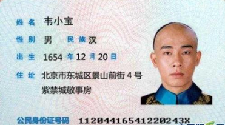

# pyocr
python chinese idcard recogntion api based on ctpn + densenet. 
### environment
  * [x] python2.7
  * [x] tensorflow-1.5.0
  * [x] cuda9.0
  * [x] cudnn-7.0.5
### install
```
[prerequisites]
sudo make prerequisites
[gpu]
sudo make install.gpu
[cpu]
sudo make install.cpu
```
### test
```
- inference
make test.infer
- rest
[run rest app]
make test.rest
```



```
[test]
$ curl -F "img=@samples/weixiaobao.png" http://0.0.0.0:5000/ocr
>>>
{
  "民族": "汉", 
  "住址": "北京市东城区景山前街4号紫禁城敬事房", 
  "性别": "男", 
  "公民身份号码": "4416541220243W", 
  "出生": "1654年12洞20吕", 
  "姓名": "韦小小宝"
}
```

### Thanks
- [YCG09](https://github.com/YCG09/chinese_ocr)
- [Sanster](https://github.com/Sanster/DeepOcrService)
