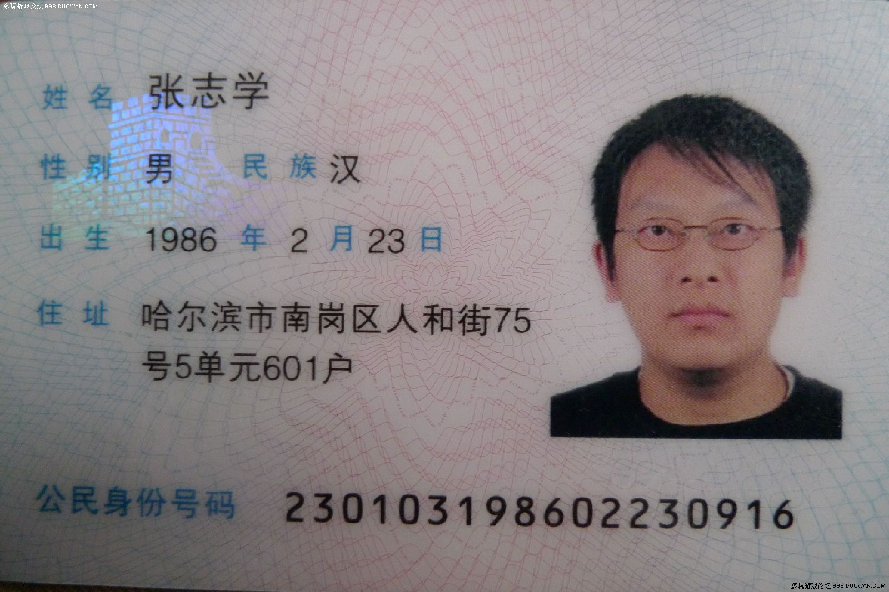

# pyocr
python chinese ocr rest api based on ctpn + densenet. this code was tested on python2.7, tensorflow-1.5.0, cuda9.0, cudnn-7.0.5
### install
```
[prerequisites]
sudo make prerequisites
[gpu]
sudo make install.gpu
[cpu]
sudo make install.cpu
```
### test
```
- inference
make test.infer
- rest
[run rest app]
make test.rest
```



```
[test]
$ curl -F "img=@samples/1.jpg" http://0.0.0.0:5000/ocr
>>>
{
  "results": [
    {
      "text": "姓名张志学", 
      "pos": [
        46, 
        110, 
        433, 
        182
      ]
    }, 
    {
      "text": "在宁", 
      "pos": [
        223, 
        186, 
        336, 
        236
      ]
    }, 
    {
      "text": "性男民族汉", 
      "pos": [
        47, 
        223, 
        624, 
        291
      ]
    }, 
    {
      "text": "出生1986年2月23曰", 
      "pos": [
        47, 
        336, 
        688, 
        389
      ]
    }, 
    {
      "text": "住址哈尔滨市南岗区人和街75", 
      "pos": [
        47, 
        450, 
        816, 
        518
      ]
    }, 
    {
      "text": "号5单元601户", 
      "pos": [
        206, 
        527, 
        545, 
        591
      ]
    }, 
    {
      "text": "公民身份号码", 
      "pos": [
        45, 
        726, 
        370, 
        803
      ]
    }, 
    {
      "text": "230103198602230916", 
      "pos": [
        415, 
        743, 
        1216, 
        812
      ]
    }, 
    {
      "text": "多玩遂爱论坛gas.ouCist.cOM", 
      "pos": [
        1183, 
        883, 
        1344, 
        899
      ]
    }
  ]
}
```

### Thanks
- [YCG09](https://github.com/YCG09/chinese_ocr)
- [Sanster](https://github.com/Sanster/DeepOcrService)
